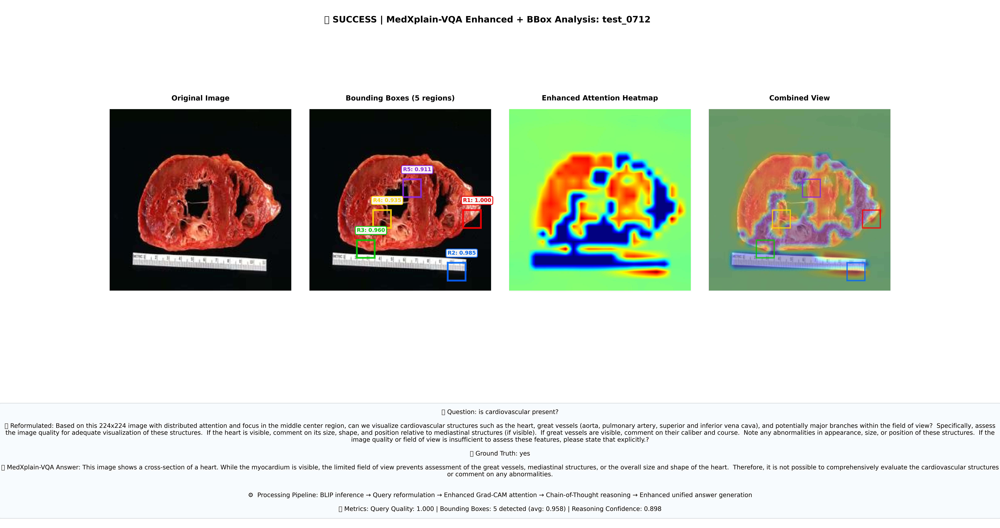
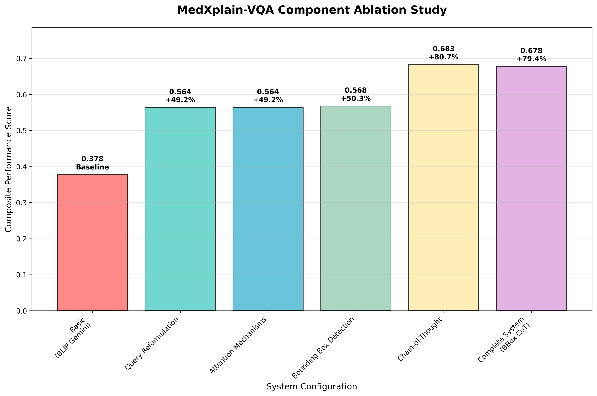

# MedXplain-VQA: Multi-Component Explainable Medical Visual Question Answering

<div align="center">

[](ICHST-2025_paper_9574.pdf)
[](LICENSE)
[](https://python.org)
[](https://pytorch.org)

*A comprehensive framework for explainable medical visual question answering with multi-component AI integration*

[**Paper**](ICHST-2025_paper_9574.pdf) | [**Demo**](#demo) | [**Installation**](#installation) | [**Documentation**](#usage)

</div>

## 🔥 News
- **[2025-07]** IEEE Proceedings
- **[2025-06]** Paper accepted at ICHST2025
- **[2025-04]** Paper submitted to ICHST-2025
- **[2025-01]** Code and models released

## 📋 Abstract

**MedXplain-VQA** presents a novel framework integrating five explainable AI components to deliver interpretable medical image analysis. Our approach combines fine-tuned BLIP-2, medical query reformulation, enhanced Grad-CAM attention, precise region extraction, and structured chain-of-thought reasoning via multi-modal language models.

**Key Results:**
- 🎯 **+80.8% improvement** with Chain-of-Thought reasoning
- 📊 **0.683 composite score** vs 0.378 baseline
- 🔍 **3-5 diagnostically relevant regions** per sample
- 💯 **0.890 reasoning confidence** with medical terminology

---

## 🚀 Quick Start

### Installation

```bash
# Clone repository
git clone https://github.com/your-username/medxplain-vqa.git
cd medxplain-vqa

# Install dependencies
pip install -r requirements.txt

# Configure API keys
cp configs/api_keys.yaml.template configs/api_keys.yaml
# Edit configs/api_keys.yaml with your Gemini API key
```

### Basic Usage

```bash
# Basic VQA mode
python scripts/medxplain_vqa.py --mode basic \
    --config configs/config.yaml \
    --model-path checkpoints/blip/checkpoints/best_hf_model

# Enhanced explainable mode (full pipeline)
python scripts/medxplain_vqa.py --mode enhanced --enable-bbox --enable-cot \
    --config configs/config.yaml \
    --model-path checkpoints/blip/checkpoints/best_hf_model
```

### Demo

<div align="center">

<p><i>Example output: Enhanced MedXplain-VQA analysis showing visual attention maps, bounding box regions, and structured medical reasoning</i></p>
</div>

The system generates comprehensive explanations with:
- ✅ **Visual attention maps** highlighting relevant regions
- ✅ **Bounding box localization** of diagnostic features  
- ✅ **Step-by-step medical reasoning** chains
- ✅ **Confidence scoring** for each component

---

## 🏗️ Architecture

<div align="center">

<p><i>MedXplain-VQA System Architecture: 5-stage progressive enhancement pipeline</i></p>
</div>

**MedXplain-VQA** implements a 5-stage progressive enhancement pipeline:

1. **🔬 Fine-tuned BLIP-2**: Medical domain adaptation on PathVQA
2. **💬 Query Reformulation**: Medical context enhancement via Gemini-1.5-Pro  
3. **👁️ Enhanced Grad-CAM**: Attention visualization with spatial precision
4. **📍 Bounding Box Extraction**: Region localization from attention maps
5. **🧠 Chain-of-Thought**: Structured diagnostic reasoning (6 steps)

### Key Components

| Component | Purpose | Performance |
|-----------|---------|-------------|
| **BLIP-2 Backbone** | Vision-Language Understanding | Salesforce/blip-vqa-base |
| **Query Reformulation** | Medical Context Enhancement | +49.2% improvement |
| **Enhanced Grad-CAM** | Visual Attention Analysis | 0.959 attention quality |
| **Bounding Boxes** | Spatial Localization | 3-5 regions per image |
| **Chain-of-Thought** | Medical Reasoning | 0.890 confidence |

---

## 📊 Results

### Performance Comparison

| Method | Medical Terms | Attention Quality | Reasoning Support | Composite Score |
|--------|---------------|-------------------|-------------------|-----------------|
| PathVQA Baseline | 0.284 | --- | --- | **0.341** |
| BLIP-2 + Grad-CAM | 0.312 | 0.587 | --- | **0.402** |
| Medical ChatGPT-4V | 0.356 | Limited | Limited | **0.428** |
| **MedXplain-VQA** | **0.435** | **0.959** | **0.890** | **0.683** |

### Ablation Study

<div align="center">

</div>

| Configuration | Composite Score | Improvement |
|---------------|-----------------|-------------|
| Basic (BLIP + Gemini) | 0.378 | Baseline |
| + Query Reformulation | 0.564 | +49.2% |
| + Bounding Boxes | 0.568 | +50.3% |
| + Chain-of-Thought | **0.683** | **+80.8%** |

---

## 🔧 Installation & Setup

### Requirements

- Python 3.8+
- PyTorch 2.1+
- CUDA 11.8+ (recommended)
- 16GB+ RAM
- Google Gemini API key

### Environment Setup

```bash
# Create conda environment
conda create -n medxplain python=3.8
conda activate medxplain

# Install PyTorch with CUDA
pip install torch==2.1.0 torchvision==0.16.0 --index-url https://download.pytorch.org/whl/cu118

# Install other dependencies
pip install -r requirements.txt
```

### Model Checkpoints

Download the fine-tuned BLIP-2 model:

```bash
# Option 1: Download from Hugging Face Hub
python scripts/download_model.py --model Salesforce/blip-vqa-base

# Option 2: Use pre-trained checkpoint (if available)
# Place checkpoint in checkpoints/blip/checkpoints/best_hf_model/
```

### Configuration

1. **API Keys**: Copy `configs/api_keys.yaml.template` to `configs/api_keys.yaml`
2. **Model Paths**: Update `configs/config.yaml` with correct checkpoint paths
3. **Data Paths**: Ensure PathVQA dataset is placed in `data/` directory

---

## 💻 Usage

### Command Line Interface

```bash
python scripts/medxplain_vqa.py [OPTIONS]
```

**Arguments:**
- `--mode`: Processing mode (`basic`, `explainable`, `enhanced`)
- `--config`: Configuration file path
- `--model-path`: BLIP model checkpoint path
- `--enable-bbox`: Enable bounding box extraction
- `--enable-cot`: Enable Chain-of-Thought reasoning
- `--image`: Specific image path (optional)
- `--question`: Specific question (optional)
- `--num-samples`: Number of test samples

### Processing Modes

#### 1. Basic Mode
```bash
python scripts/medxplain_vqa.py --mode basic
```
- BLIP-2 inference + Gemini enhancement
- Fast processing (~8-12s per sample)
- Basic medical terminology

#### 2. Explainable Mode  
```bash
python scripts/medxplain_vqa.py --mode explainable --enable-bbox
```
- + Enhanced Grad-CAM attention
- + Bounding box extraction
- Visual explainability (~15-20s per sample)

#### 3. Enhanced Mode (Full Pipeline)
```bash
python scripts/medxplain_vqa.py --mode enhanced --enable-bbox --enable-cot
```
- + Chain-of-Thought reasoning
- + Medical context integration
- Complete explainability (~24-28s per sample)

### Python API

```python
from src.models.blip2.model import BLIP2VQA
from src.utils.config import Config

# Load configuration
config = Config('configs/config.yaml')

# Initialize model
model = BLIP2VQA(config, train_mode=False)

# Run inference
result = model.predict(image, question)
```

---

## 📚 Evaluation

### Medical Evaluation Suite

```bash
# Run comprehensive evaluation
python scripts/medical_evaluation_suite.py --output-dir data/medical_evaluation

# Ablation study
python scripts/final_ablation_analysis.py

# Generate paper figures
python scripts/paper_figures_generator.py
```

### Evaluation Metrics

Our medical-domain evaluation framework includes:

- **Medical Terminology Coverage**: Clinical vocabulary usage
- **Clinical Structure Assessment**: Professional formatting
- **Explanation Coherence**: Logical reasoning flow
- **Attention Quality**: Visual region relevance  
- **Reasoning Confidence**: Diagnostic certainty

### Reproducing Results

```bash
# Download PathVQA dataset
python scripts/download_pathvqa.py

# Run full evaluation pipeline
bash scripts/reproduce_results.sh
```

---

## 📂 Project Structure

```
medxplain-vqa/
├── configs/                    # Configuration files
│   ├── config.yaml            # Main configuration
│   └── api_keys.yaml          # API keys (not in repo)
├── src/                       # Source code
│   ├── models/                # Model implementations
│   │   ├── blip2/            # BLIP-2 model
│   │   ├── llm/              # LLM integration  
│   │   └── vqa/              # VQA components
│   ├── explainability/       # Explainable AI modules
│   │   ├── reasoning/        # Chain-of-Thought
│   │   ├── rationale/        # Medical reasoning
│   │   └── grad_cam.py       # Attention visualization
│   ├── preprocessing/        # Data preprocessing
│   └── utils/                # Utilities
├── scripts/                  # Execution scripts
│   ├── medxplain_vqa.py     # Main inference script
│   ├── medical_evaluation_suite.py  # Evaluation
│   └── paper_figures_generator.py   # Results visualization
├── data/                    # Data and results
│   ├── images/             # PathVQA images
│   ├── questions/          # Question files
│   └── paper_figures/      # Generated figures
└── docs/                   # Documentation
```

---

## 🔬 Research

### Citation

If you use MedXplain-VQA in your research, please cite our work (currently under review):

```bibtex
@article{nguyen2025medxplain,
  title={MedXplain-VQA: Multi-Component Explainable Medical Visual Question Answering},
  author={Nguyen, Hai-Dang and Dang, Minh-Anh and Le, Minh-Tan and Le, Minh-Tuan},
  journal={International Conference on Health Science and Technology (ICHST)},
  year={2025},
  note={Under Review}
}
```

### Related Work

- **BLIP-2**: [Bootstrapping Language-Image Pre-training](https://arxiv.org/abs/2301.12597)
- **PathVQA**: [PathVQA: 30000+ Questions for Medical Visual Question Answering](https://arxiv.org/abs/2003.10286)
- **Grad-CAM**: [Visual Explanations from Deep Networks via Gradient-based Localization](https://arxiv.org/abs/1610.02391)

---

## 🤝 Contributing

We welcome contributions! Please see [CONTRIBUTING.md](CONTRIBUTING.md) for guidelines.

### Development Setup

```bash
# Install development dependencies
pip install -r requirements-dev.txt

# Run tests
python -m pytest test/

# Code formatting
black src/ scripts/
flake8 src/ scripts/
```

---

## 📄 License

This project is licensed under the MIT License - see the [LICENSE](LICENSE) file for details.

---

## 🙏 Acknowledgments

- **GPU Support**: ThueGPU.vn for computational resources
- **Dataset**: PathVQA team for the medical VQA dataset
- **Models**: Salesforce for BLIP-2, Google for Gemini API
- **Institutions**: VNU-UET, VKIST, TADI Global, Banking Academy of Vietnam

---

## 📞 Contact

For questions and support:

- **Hai-Dang Nguyen**: [Email](mailto:dang.nh@vnu.edu.vn) | [ORCID](https://orcid.org/0009-0009-2783-800X)
- **Minh-Anh Dang**: [Email](mailto:anh.dm@vkist.vn) | [ORCID](https://orcid.org/0009-0009-2274-7109)
- **Project Issues**: [GitHub Issues](https://github.com/your-username/medxplain-vqa/issues)

---

<div align="center">
<b>⭐ Star this repository if you find it helpful!</b>
</div> 
# vi_medxplain
